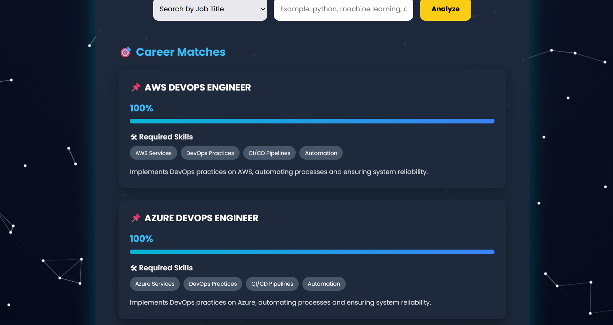

# 🚀 MatchMyTalent Engine

**AI-powered Career Recommendation & Skill Gap Analysis System**  

MatchMyTalent Engine is a web application that helps users find suitable jobs based on their skills or desired job titles. It provides personalized recommendations, identifies missing skills, generates a learning roadmap, and suggests relevant courses.

---

## 🌟 Features

- **Search by Skills:** Enter your current skills and get a list of jobs that match your profile.  
- **Search by Job Title:** Search for a specific job title and get required skills and job description.  
- **Skill Gap Analysis:** Highlights missing skills for your target job and generates a learning roadmap.  
- **Learning Roadmap:** Step-by-step guide on which skills to learn next.  
- **Recommended Courses:** Suggests top courses from Coursera, Udemy, and other platforms.  
- **Interactive UI:** Clean and modern interface with badges, progress bars, and cards.  

---

## 🛠 Technologies Used

- **Backend:** Python, Flask  
- **Data Processing:** pandas, scikit-learn (TF-IDF, cosine similarity)  
- **Frontend:** HTML, CSS, JavaScript  
- **Visualization (optional):** CSS animations, progress bars  
- **Hosting (optional):** Render, Heroku, or any Flask-compatible platform  

---

## 🖥 Screenshots

  
*Home page with skill/job search input*  

  
*Results showing match score, missing skills, roadmap, and courses*  

---

## ⚡ How to Run Locally

1. **Clone the repository**
   ```bash
   git clone <YOUR_REPO_LINK>
   cd MatchMyTalent

2.Create a virtual environment (recommended)
    python -m venv venv
   source venv/bin/activate  # Linux/Mac 
   venv\Scripts\activate     # Windows


3.Install dependencies
  pip install -r requirements.txt

4.Run the Flask app
  python app.py

Open your browser and go to: http://127.0.0.1:5000

⚠ Note: This is a local address, so it only works on your computer. To share your app publicly, deploy it using Heroku, Render, or PythonAnywhere.
  
